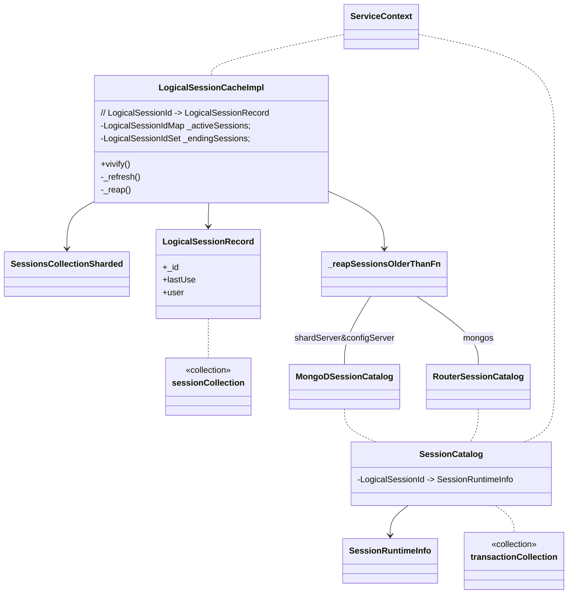

[TOC]





## LogicalSessionId

### LogicalSession的标识 - lsid

LogicalSession 由 "logical session id"(`lsid`) 标识。`lsid` 由两部分信息组成：

* `id` - 全局唯一的id(UUID)，由 driver 或者 startSession命令 生成
* `uid`(user id) - 登录用户的唯一标识 // 如果 authentication 开启


### logicalSession 信息(`lsid`) 生成

`lsid`可以在 driver 生成，也可以在 server 生成

* driver 生成 `lsid` ( src/mongo/shell/session.js 中的 `ServerSession` )：driver在链接Server前，通过 `Mongo.prototype.startSession` 获得一个 `ServerSession`， `ServerSession` 初始化时，进行 `this.handle = client._startSession();` （实际上调用 C++ `MongoBase::Functions::_startSession::call` ）中生成 `lsid`. `ServerSession`也 提供了 `injectSessionId` & `assignTransactionNumber` 分别为 cmd append `lsid` & `txnNumber` 字段。
* server生成 `lsid`：则是提供了 `startSession` command 来支持（同时将 lsid 信息存储到 `logicalSessionCache` 中）。该命令返回一个UUID信息 `{ "id" : UUID("807bac7b-6a17-423e-9aaf-bb84682666bb") }`


### logicalSession 信息(`lsid`) 处理

server 收到用户请求以后，在真正请求处理之前，会首先解析其中的`lsid` & `txnNumber` 等信息并vivify（`initializeOperationSessionInfo`）。


vivify(`LogicalSessionCacheImpl::vivify()`) 是将lsid信息添加到 `logicalSessionCache` 并更新其缓存entry的 lastUse 时间，除了收到用户请求时会进行 vivify 外：

* cursor checkout - `CursorManager::pinCursor()` & `ClusterCursorManager::checkOutCursor()`
* `refreshSessions` command


### 存储lsid

每个节点（mongos、shard、config）都有一个 in-memory cache 缓存当前节点正在使用的 session 信息，称为 `logicalSessionCache` 。`logicalSessionCache` 中的每个 entry 包含：

- `_id` - session 的 lsid
- `user` - session 的 登录用户名
- `lastUse` - session 上次使用的时间

`logicalSessionCache` 定期将 entry 信息持久化到 `config.system.sessions` 集合（被称为 `sessions collection`)中，这个集合的存储位置因MongoDB运行形态不同而改变：

| Cluster Type     | Sessions Collection 持久存储位置                             |
| :--------------- | :----------------------------------------------------------- |
| `Standalone`     | `logicalSessionCache` 所在的节点                             |
| `ReplicaSet`     | primary节点 并复制给 Seceondaries                            |
| `ShardedCluster` | 作为一个 sharded collection 存在 - 可以存在在各个shard上，且有多个chunk |

 `config.system.sessions` 集合中，在 `lastUse` 字段上会创建一个 TTL 索引，索引过期时间默认为 30min。也就是说如果一个 session 超过 30min 没有被使用，那么 TTL索引 就会将这个 session 在 `config.system.sessions` 中清理掉。

## LogicalSessionCache 的 refresh机制 & reap机制

`LogicalSessionCache` 中有 `_activeSessions` 和 `_endingSessions` 2个成员变量来存储 LogicalSession 信息。

* `_activeSessions` 是一个 LogicalSessionId --> LogicalSessionRecord 的 map结构
  * 上文提到 LogicalSessionCache 中的每个 cache entry 实际上就是 `LogicalSessionRecord`。该结构体中包含 `_id` / `lastUse` / `user` 几个field。而系统在对某个 lsid 进行 vivify 的行为，就是在 `_activeSessions` 检索对应的 `LogicalSessionRecord`，如果能检索到，则更新其 `lastUse` ，检索不到则构造一个 `LogicalSessionRecord` 添加到 `_activeSessions`。
* `_endingSessions` 是存储 LogicalSessionId 的 一个set结构。主要用来标识通过 `endSessions` 命令显式关闭的session


`_activeSessions` & `_endingSessions` 在接下来描述的 refresh机制 & reap机制 中会与 `config.system.sessions` 集合交互，进行缓存信息的刷新。

refresh & reap 机制都是定时执行的，受 `logicalSessionRefreshMillis` 配置影响，默认时间间隔为 5min。

#### refresh 机制 -- `LogicalSessionCacheImpl::_refresh()`

#####  step1 - 初始状态处理

确认 `config.system.sessions` 状态正常

1. `ShardedCluster`的 `config.system.sessions` 以 sharded collection 的方式存在
   * 对于 mongos&shardServer，这里只会检查 `config.system.sessions` 集合是否存在。分片集群环境下，该集合的创建由 configServer 负责
   * 对于 configServer
     * 检查 `config.system.sessions` 不存在，则会给自己发送一个 `_configsvrShardCollection` 的命令进行 shardCollection (shardKey: { _id: 1})
     * 向 `config.system.sessions` 相关的shard 发送 `createIndexes` 命令，{ "lastUse": 1 } ，TTL 索引 ， 超时时间为 **localLogicalSessionTimeoutMinutes** 配置（默认30min）
2. `ReplicaSet` - primary节点 并复制给 Seceondaries。验证index是否正确，如果不正确，primary节点直接进行修正（collMod or createIndexes），secondary节点则将请求发送给primary
3. `Standalone` - `config.system.sessions` 存储在当前节点。行为同 ReplicaSet 的 primary节点

##### step2 - session 管理

**step2.1** - 获取`activeSessions` & `explicitlyEndingSessions` // 当前活跃的session 和 显示关闭的session

1. 通过加锁+swap的方式 拿到 `_activeSessions` & `_endingSessions` 中存储的信息，分别存储到 `activeSessions` & `explicitlyEndingSessions`
2. 从 `activeSessions` 清理掉 `explicitlyEndingSessions` 中的 lsid
3. 获取正在运行的client的lsid，如果这些lsid没在 `explicitlyEndingSessions` 中则并添加到 `activeSessions`

**step2.2** - 将 `activeSessions` 中的 session 更新到 `config.system.sessions`

> md step1: All sessions that have been used on this node since the last refresh will be upserted to the sessions collection. This means that sessions that already exist in the sessions collection will just have their `lastUse` fields updated.

对 `config.system.sessions` 进行如下操作

```json
{
	"update": "config.system.sessions",
	"ordered": false,
	"allowImplicitCollectionCreation": false,
	"writeConcern": "majority",
	"docSeq": [
		{"q": {"_id": <lsid> }, "u": {{ $currentDate : { lastUse : true }, $setOnInsert : { user : <user> } } }, upsert: true}
	]
}
```


**step2.3** - 将 `explicitlyEndingSessions` 中的 session 从 `config.system.sessions` 中移除

> md step2: All sessions that have been ended in the cache on this node (via the endSessions command) will be removed from the sessions collection.

对 `config.system.sessions` 进行如下操作

```json
{
	"delete": "config.system.sessions",
	"ordered": false,
	"writeConcern": "majority",
	"docSeq": [
		{"q": {"_id": <lsid> }, limit: 0}
	]
}
```


##### step3 - cursor 管理

**step3.1** - 获取 `openCursorSessions` // 处于打开状态的cursor对应的session

1. 从 `CursorManager` 中拿到所有未处于 killPending 状态的cursor 对应的session
2. 排除在 `_activeSessions` 中的session，因为前面对 `_activeSessions` & `activeSessions` 进行swap，所以在 `_activeSessions` 中的session是新进入的请求，没有refresh到 `config.system.sessions`，所以需要排除

**step3.2** - 从 `config.system.sessions` 获取 `openCursorSessions` 中已经被remove的session（ `removedSessions`）

> md step3: Sessions that have expired from the sessions collection will be removed from the logical session cache on this node.

这里实际上就是将 sessions 以 1000 为单位拆分成多个 batch，依次去 `config.system.sessions` 查询，过滤出不存在的session

**step3.3** - 关闭`removedSessions` 和 `explicitlyEndingSessions` 对应的 cursor

> md step4: All cursors registered on this node that match sessions that have been ended (md step 2) or were expired (md step 3) will be killed.


#### reap 机制 -- `LogicalSessionCacheImpl::_reap()`

mongos&shardServer都会有一个 `SessionCatalog` 的组件来记录事务的一些运行状态


reap机制就是从 `SessionCatalog` 中提取可能已经 expired 的session（上次活跃时间距离现在超过 `gTransactionRecordMinimumLifetimeMinutes`（30min））的session。

再从 `config.system.sessions` 中获取上面session中确实已经被删除的session，将这些session在 `SessionCatalog` 中删除


此外，primary节点中还会有一个 `config.transactions` 集合存储与 `SessionCatalog` 对应的记录作为持久化。所以还会其中与上面提到的session中对齐的信息，（分批删除，单次最多10000条）

> config.transaction  / SessionCatalog / MongoDSessionCatalog 会参与并记录当前节点的一些在执行的一些事务状态

## LogicalSession 与 其他组件 的关系

### LogicalSession 与 opCtx/Cursor 的关系

首先简单说下 `cursor` 和 `opCtx` 的关系。`cursor` 可能会被理解为是依附在 `opCtx` 中。但实际上 `cursor` 是一直存在的，而 `opCtx` 只有用户真正请求的时候才会被创建。`cursor` 在被使用命令使用的时候从 `ClusterCursorManager` 中 checkOut 出来，这时会reattach到 `opCtx` 中，而命令执行完需要再checkIn回 `ClusterCursorManager` 中，此时deattachFrom opCtx。


`opCtx` 中有 `setLogicalSessionId` 的入口，但是注释中说明可能只会设置一次：May only be called once for the lifetime of the operation. 这里主要会在请求初始化的时候，进行 `setLogicalSessionId` （即在 `initializeOperationSessionInfo`中进行）。其他场景有内部交互时新建 opCtx 也会set lsid。


`cursor` 中只在创建是可以指定lsid，后续只能getLsid。也就是说 cursor 和 lsid 是强绑定的关系。而在对 `cursor` checkOut时，也会默认基于 cursor 中存储的 lsid 进行校验。

```c++
// src/mongo/s/query/cluster_cursor_manager.cpp:348
// Check if the user is coauthorized to access this cursor.
auto authCheckStatus = authChecker(entry->getAuthenticatedUsers());
if (!authCheckStatus.isOK()) {
  return authCheckStatus.withContext(str::stream()
                                     << "cursor id " << cursorId
                                     << " was not created by the authenticated user");
}
```

以下其中一个满足时才会允许checkOut：

* context session id must match cursor session id. // lsid 匹配
* user must be magic special (__system, or background task, etc)  // 内部任务或账号


Q：sessionA创建了cursor，而sessionB使用cursor的id进行getMore 的行为是怎样的？

sessionB 提供的 lsid 需要与cursor中存储的 lsid 匹配才能checkOut成功（即进行getMore）


Q：session空闲，cursor一定空闲么？

是的，cursor使用的时候会更新其上存储的lsid的lastUse，即创建当前cursor的session


Q：cursor空闲，session一定空闲么？

不是，session可能执行非cursor相关的命令

### LogicalSession 与 txnNumber 的关系

使用 [官方文档](https://docs.mongodb.com/manual/core/transactions-in-applications/#mongo-shell-example) 中提供的命令执行事务。 // 这里不执行最后的 `session.endSession();`


命令中显示进行了 `startSession()`，所以这里使用的lsid为：

```js
rs8400:PRIMARY> session = db.getMongo().startSession( { readPreference: { mode: "primary" } } );
session { "id" : UUID("97d5f526-6e95-4394-b6cf-683480499cdd") }
```

最终server端打印的请求执行结果日志：

```
2021-03-09T15:03:03.297+0800 I  TXN      [conn20] transaction parameters:{ lsid: { id: UUID("97d5f526-6e95-4394-b6cf-683480499cdd"), uid: BinData(0, C77E46E0CE3E66F5656583BC39832C6A39F0DD4BFCB780E25591864F05D3058E) }, txnNumber: 0, autocommit: false ... terminationCause:committed timeActiveMicros:595 timeInactiveMicros:2572309 ...  wasPrepared:0, 2572ms
```

可以看到 **txnNumber = 0** 


重复执行 transaction 相关命令：

```js
// Start a transaction
session.startTransaction( { readConcern: { level: "local" }, writeConcern: { w: "majority" } } );

// Operations inside the transaction
try {
   coll1.insertOne( { abc: 1 } );
   coll2.insertOne( { xyz: 999 } );
} catch (error) {
   // Abort transaction on error
   session.abortTransaction();
   throw error;
}

// Commit the transaction using write concern set at transaction start
session.commitTransaction();
```

这里没有 `startSession`，所以在server看到的日志为：

```
2021-03-09T15:04:15.058+0800 I  TXN      [conn20] transaction parameters:{ lsid: { id: UUID("97d5f526-6e95-4394-b6cf-683480499cdd"), uid: BinData(0, C77E46E0CE3E66F5656583BC39832C6A39F0DD4BFCB780E25591864F05D3058E) }, txnNumber: 1, autocommit: false ... terminationCause:committed timeActiveMicros:482 timeInactiveMicros:924948 ... wasPrepared:0, 925ms
```

可以看到 lsid与上文相同，**txnNumber = 1**

## LogicalSession 相关指标

以mongos输出为例

```json
mongos> db.serverStatus().logicalSessionRecordCache
{
	"activeSessionsCount" : 1,
	"sessionsCollectionJobCount" : 4321,
	"lastSessionsCollectionJobDurationMillis" : 1,
	"lastSessionsCollectionJobTimestamp" : ISODate("2021-03-11T11:46:11.029Z"),
	"lastSessionsCollectionJobEntriesRefreshed" : 0,
	"lastSessionsCollectionJobEntriesEnded" : 0,
	"lastSessionsCollectionJobCursorsClosed" : 0,
	"transactionReaperJobCount" : 4321,
	"lastTransactionReaperJobDurationMillis" : 1,
	"lastTransactionReaperJobTimestamp" : ISODate("2021-03-11T11:46:11.029Z"),
	"lastTransactionReaperJobEntriesCleanedUp" : 0,
	"sessionCatalogSize" : 0
}
```

* **activeSessionsCount : 上次刷新以来，缓存在内存中的本地活跃session数量**
* **sessionsCollectionJobCount : session refresh执行次数**
* **lastSessionsCollectionJobDurationMillis : 上次session refresh执行耗时**
* lastSessionsCollectionJobTimestamp : 上次session refresh发生的时间点
* **lastSessionsCollectionJobEntriesRefreshed : 上次session refresh期间，刷新的session数量**
* **lastSessionsCollectionJobEntriesEnded : 上次session refresh期间，结束的session数量**
* **lastSessionsCollectionJobCursorsClosed : 上次session refresh期间，关闭的cursor数量**
* **transactionReaperJobCount : transaction reaper执行次数**
* **lastTransactionReaperJobDurationMillis : 上次transaction reaper执行耗时**
* lastTransactionReaperJobTimestamp : 上次transaction reaper发生的时间点
* **lastTransactionReaperJobEntriesCleanedUp : 上次transaction reaper清理的entry数量**
* **sessionCatalogSize : [4.2] 内存中缓存的session数量**

