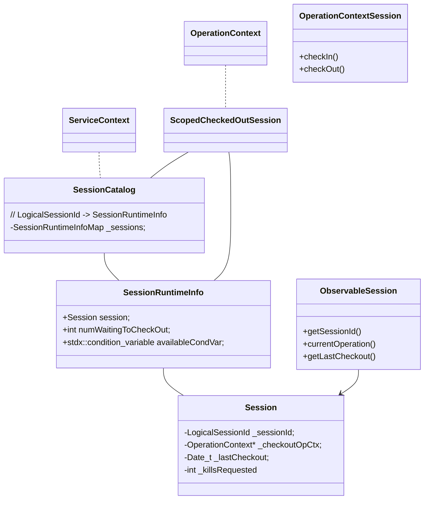

### 核心类关系结构




类关系看起来比较复杂一些，其实核心都在 `SessionCatalog` ，其他的组件都是为 `SessionCatalog` 服务的。

`SessionCatalog` 用于记录当前活跃session的事务运行状态。运行状态记录在内部维护的一个 SessionRuntimeInfoMap（`LogicalSessionId` -> `SessionRuntimeInfo`）中，`SessionRuntimeInfo` 是负责管理 `Session`的。

`SessionCatalog` 提供了几个能力，由上述组件来协同完成：

* 记录事务使用到的 session 的状态：由 `OperationContextSession` 的 `checkIn` & `checkOut` 完成。`checkOut` 是串行的，使用 notify 机制来实现串行逻辑，`checkOut`的结果是 `ScopedCheckedOutSession`，将其与 opCtx 绑定。`checkIn` 时会析构 `ScopedCheckedOutSession`，并进行 notify。
* session管理：`scanSession` & `killSession`。scanSession 匹配 map中符合要求的session并执行操作，执行的操作收敛在 `ObservableSession` 中。


何时会checkIn & checkOut？

对于mongod来说，如果请求中包含 `txnNumber`（事务请求&retryWrite请求） 并且命令不是特定命令（`coordinateCommitTransaction`/`replSetStepDown`），那么在执行请求时会进行 checkIn&checkOut （通过 `OperationContextSession` 实现 -- RAII）

对于 mongos 来说，只有事务请求（入参中设置了 autocommit）才会进行checkOut&checkIn，同样是通过 `OperationContextSession` 实现


## RetryableWrite

### 客户端如何处理 retryWrite -- mongo shell

客户端记录 wireVersion 版本支持的特性，在 `prepareCommandRequest` 时，判断同时满足：1. 服务端 isMaster 返回的版本信息支持 retryWrite；2. mongo shell启动选项携带 --retryWrite； 3. 本次执行的命令可以进行 retryWrite，会为本次请求增加 txnNumber 字段（`assignTransactionNumber`）（在此之前已经添加了 `lsid` 字段）

```js
// Retryable writes code should execute only we are not in an active transaction.
if (jsTest.options().alwaysInjectTransactionNumber &&
    serverSupports(kWireVersionSupportingRetryableWrites) &&
    driverSession.getOptions().shouldRetryWrites() &&
    _ServerSession.canRetryWrites(cmdObj)) {
  cmdObj = driverSession._serverSession.assignTransactionNumber(cmdObj);
}
```

随后在请求下发时，对于 retryWrite 的请求，默认增加一次重试逻辑。重试的标准为（具体参考[文档](https://github.com/mongodb/specifications/blob/5b53e0baca18ba111364d479a37fa9195ef801a6/source/retryable-writes/retryable-writes.rst#terms)）：

```js
// Returns true if the error code is retryable, assuming the command is idempotent.
function isRetryableCode(code) {
  return ErrorCodes.isNetworkError(code) || ErrorCodes.isNotMasterError(code) ||
    ErrorCodes.isShutdownError(code) || ErrorCodes.WriteConcernFailed === code;
}
```


### 服务端处理 retryWrite

#### mongos/mongod 添加stmtId

客户端执行 retryWrite 时仅会添加 `lsid` & `txnNumber` 字段，而mongos/ mongod 还会为每个write操作分配并添加一个 `stmtId` 字段。 ShardedCluster由mongos来分配 `stmtId` 为了保证该字段在同 `txnNumber` 中唯一，ReplicaSet 则直接由mongod来分配

```c++
int32_t getStmtIdForWriteAt(const WriteCommandBase& writeCommandBase, size_t writePos) {
    const auto& stmtIds = writeCommandBase.getStmtIds();
		// writeCommand 中携带 stmtIds 字段，从其中获取。比如 shardServer 接收 mongos 的请求，直接从其中获取 stmtId
    if (stmtIds) {
        return stmtIds->at(writePos);
    }
		// 否则，根据其所在的 pos ，分配一个 stmtId
    const auto& stmtId = writeCommandBase.getStmtId();
    const int32_t kFirstStmtId = stmtId ? *stmtId : 0;
    return kFirstStmtId + writePos;
}
```


lsid + txnNumber + stmtId 共同构成一条可重试写操作（write operation）的唯一标识


#### primary节点 check statement是否真正需要执行

primary节点执行 write operation前，会基于 `stmtId` 判断该请求是否已经被执行了，如果已经执行则直接构造返回结果。

```c++
// 按照上文行为，分配或者获取 stmtId
const auto stmtId = getStmtIdForWriteOp(opCtx, wholeOp, stmtIdIndex++);
// txnNumber参数标识 该请求可能为 多文档事务 或者 retryWrite
if (opCtx->getTxnNumber()) {
  // retryWrite请求（非多文档事务请求，即未传递 autocommit 字段）
  if (!opCtx->inMultiDocumentTransaction() &&
      // 请求已经被执行
      txnParticipant.checkStatementExecutedNoOplogEntryFetch(stmtId)) {
    containsRetry = true;
    RetryableWritesStats::get(opCtx)->incrementRetriedStatementsCount();
    // 直接构造结果并返回
    out.results.emplace_back(makeWriteResultForInsertOrDeleteRetry());
    continue;
  }
}
```


判断的标准是 `TransactionParticipant` 的 `PrivateState` 组件会记录一个 StmtId --> repl::OpTime 的map结构(`activeTxnCommittedStatements`)，判断该operation的 `stmtId` 是否已经存在于该map结构中。而对于 update 请求，还会额外的从 oplog中读取该optime的log，并校验 stmtId 匹配。（insert/delete: `checkStatementExecutedNoOplogEntryFetch` , update: `checkStatementExecuted`）


上面提到的 `activeTxnCommittedStatements` （stmtId --> optime）中的记录是如何插入的呢？

`OpObserverImpl`会监测 oplog 产生，下发oplog写入并进行 `onWriteOpCompleted`，其中会将记录插入到 `activeTxnCommittedStatements`，同时更新 `config.transactions` 集合


#### 其他相关日志、记录信息参考

mongos打印的一条 retryWrite 请求，包含 lsid & txnNumber

```
command record.record appName: "MongoDB Shell" command: insert { insert: "record", ordered: true, txnNumber: 0, lsid: { id: UUID("895f3a8c-0916-46b6-a55d-c88dca4c4b63") }, $clusterTime: { clusterTime: Timestamp(162306804
5, 3), signature: { hash: BinData(0, 0000000000000000000000000000000000000000), keyId: 0 } }, $db: "record" } nShards:1 ninserted:1 numYields:0 reslen:170 protocol:op_msg 7ms
```

config.transactions的一条retryWrite记录

```json
{ "_id" : { "id" : UUID("a384c9ed-685e-4ce1-8b34-d218db664a0f"), "uid" : BinData(0,"47DEQpj8HBSa+/TImW+5JCeuQeRkm5NMpJWZG3hSuFU=") }, 
  "txnNum" : NumberLong(0), 
  "lastWriteOpTime" : { "ts" : Timestamp(1623213830, 5), 
  "t" : NumberLong(19) }, 
  "lastWriteDate" : ISODate("2021-06-09T04:43:50.575Z") 
}
```

local.oplog.rs的一条retryWrite记录

```json
{ "ts" : Timestamp(1623213830, 5), 
  "t" : NumberLong(19), 
  "h" : NumberLong(0), 
  "v" : 2, "op" : "i", "ns" : "records.record", "ui" : UUID("b1417e33-ff82-4057-a18b-4b66ab150e0e"), 
  "wall" : ISODate("2021-06-09T04:43:50.575Z"), 
  "lsid" : { "id" : UUID("a384c9ed-685e-4ce1-8b34-d218db664a0f"), "uid" : BinData(0,"47DEQpj8HBSa+/TImW+5JCeuQeRkm5NMpJWZG3hSuFU=") }, 
  "txnNumber" : NumberLong(0), 
  "stmtId" : 0, 
  "prevOpTime" : { "ts" : Timestamp(0, 0), "t" : NumberLong(-1) }, 
  "o" : { "_id" : ObjectId("60c04758ff2134a8772eafab"), "sdf" : 33 } 
}
```


#### 参考

* https://github.com/mongodb/mongo/blob/master/src/mongo/db/s/README.md#retryable-writes
* https://docs.mongodb.com/manual/core/retryable-writes/


---


客户端记录 wireVersion 版本支持的特性，并在 `prepareCommandRequest` 时根据服务端支持的特性以及当前命令的context等来append元信息。

* 对于因果一致性（3.6+） 的服务端版本，默认添加 lsid 字段（`injectSessionId`）。如果是支持retryWrite的命令，还会增加 txnNumber 字段（`assignTransactionNumber`）。retryWrite的请求不会增加stmtId字段，而是由服务端append上去的。
* 对于支持多文档事务（4.0+）的服务端版本，会增加 txnNumber、autocommit(=false)、stmtId、startTransaction(=true) 等字段（`assignTxnInfo`）


* `lsid`  : client的sessionID (LogicalSessionID)
* `txnNumber `: session上的 transaction number，session内的txnNumber需要时递增的
* `autocommit` : 是否 autocommit
* `startTransaction` : 为 true 表示该 command 为多文档事务的第一个command
* `coordinator` : 为 true 表示目标shard为该事务的 coordinator，负责 2PC

`initializeOperationSessionInfo` 对上述参数传入做了限定（主要是后者的传入必须前者已经传入）：

* `txnNumber` 传入 依赖 `lsid` 传入，必须大于等于0
* `autocommit` 传入 依赖 `txnNumber` 传入，只可以为 false
* `startTransaction` 传入 依赖 `autocommit` 传入，只可以为true


transaction：请求中包含 lsid & txnNumber & autocommit，其中autocommit都是false，事务的第一个请求携带 startTransaction = true

```
请求1：发送给后端Scheduling remote command request: RemoteCommand 5104255 -- target:[100.81.164.181:8222] db:mydb1 cmd:{ insert: "foo", bypassDocumentValidation: false, ordered: true, stmtIds: [ 0 ], documents: [ { _id: ObjectId('60be0a3a67696fa698814228'), abc: 1.0 } ], shardVersion: [ Timestamp(0, 0), ObjectId('000000000000000000000000') ], allowImplicitCollectionCreation: false, lsid: { id: UUID("6bb67773-9030-4517-b744-69c22ec82919"), uid: BinData(0, E3B0C44298FC1C149AFBF4C8996FB92427AE41E4649B934CA495991B7852B855) }, txnNumber: 0, readConcern: { level: "local" }, startTransaction: true, coordinator: true, autocommit: false }请求1：收到的请求command mydb1.foo appName: "MongoDB Shell" command: insert { insert: "foo", ordered: true, lsid: { id: UUID("6bb67773-9030-4517-b744-69c22ec82919") }, $clusterTime: { clusterTime: Timestamp(1623067116, 8), signature: { hash: BinData(0, 0000000000000000000000000000000000000000), keyId: 0 } }, txnNumber: 0, autocommit: false, stmtId: 0, startTransaction: true, readConcern: { level: "local" }, $db: "mydb1" } nShards:1 ninserted:1 numYields:0 reslen:221 protocol:op_msg 11ms请求2：发送给后端Scheduling remote command request: RemoteCommand 5104256 -- target:[100.81.164.181:8222] db:mydb2 cmd:{ insert: "bar", bypassDocumentValidation: false, ordered: true, stmtIds: [ 1 ], documents: [ { _id: ObjectId('60be0a3a67696fa698814229'), xyz: 999.0 } ], shardVersion: [ Timestamp(0, 0), ObjectId('000000000000000000000000') ], allowImplicitCollectionCreation: false, lsid: { id: UUID("6bb67773-9030-4517-b744-69c22ec82919"), uid: BinData(0, E3B0C44298FC1C149AFBF4C8996FB92427AE41E4649B934CA495991B7852B855) }, txnNumber: 0, coordinator: true, autocommit: false }请求2：收到的请求command mydb2.bar appName: "MongoDB Shell" command: insert { insert: "bar", ordered: true, lsid: { id: UUID("6bb67773-9030-4517-b744-69c22ec82919") }, $clusterTime: { clusterTime: Timestamp(1623067116, 8), signature: { hash: BinData(0, 0000000000000000000000000000000000000000), keyId: 0 } }, txnNumber: 0, autocommit: false, stmtId: 1, $db: "mydb2" } nShards:1 ninserted:1 numYields:0 reslen:221 protocol:op_msg 2mscommitcommand admin.$cmd appName: "MongoDB Shell" command: commitTransaction { commitTransaction: 1.0, txnNumber: 0, writeConcern: { w: "majority" }, lsid: { id: UUID("6bb67773-9030-4517-b744-69c22ec82919") }, $clusterTime: {clusterTime: Timestamp(1623067116, 8), signature: { hash: BinData(0, 0000000000000000000000000000000000000000), keyId: 0 } }, autocommit: false, stmtId: 2, $db: "admin" } numYields:0 reslen:214 protocol:op_msg 10ms
```


```json
{ "_id" : { "id" : UUID("b33bc640-767f-4acf-a679-20974558ff52"), "uid" : BinData(0,"47DEQpj8HBSa+/TImW+5JCeuQeRkm5NMpJWZG3hSuFU=") },   "txnNum" : NumberLong(0),   "lastWriteOpTime" : { "ts" : Timestamp(1623213907, 3), "t" : NumberLong(19) },   "lastWriteDate" : ISODate("2021-06-09T04:45:07.716Z"),   "state" : "committed"}
```

local.oplog.rs

```json
{ "ts" : Timestamp(1623213907, 3),   "t" : NumberLong(19),   "h" : NumberLong(0),   "v" : 2,   "op" : "c",   "ns" : "admin.$cmd",   "wall" : ISODate("2021-06-09T04:45:07.716Z"),   "lsid" : { "id" : UUID("b33bc640-767f-4acf-a679-20974558ff52"), "uid" : BinData(0,"47DEQpj8HBSa+/TImW+5JCeuQeRkm5NMpJWZG3hSuFU=") },   "txnNumber" : NumberLong(0),   "prevOpTime" : { "ts" : Timestamp(0, 0), "t" : NumberLong(-1) },   "o" : {     "applyOps" : [       { "op" : "i", "ns" : "mydb1.foo", "ui" : UUID("97f32892-fd34-4157-b0e0-78b9556e415f"), "o" : { "_id" : ObjectId("60c047a51eb072f562746036"), "abc" : 1 } },       { "op" : "i", "ns" : "mydb2.bar", "ui" : UUID("0541b0e6-ebeb-4fdc-b38b-a6caee54b60f"), "o" : { "_id" : ObjectId("60c047a51eb072f562746037"), "xyz" : 999 } }     ]   } }
```


