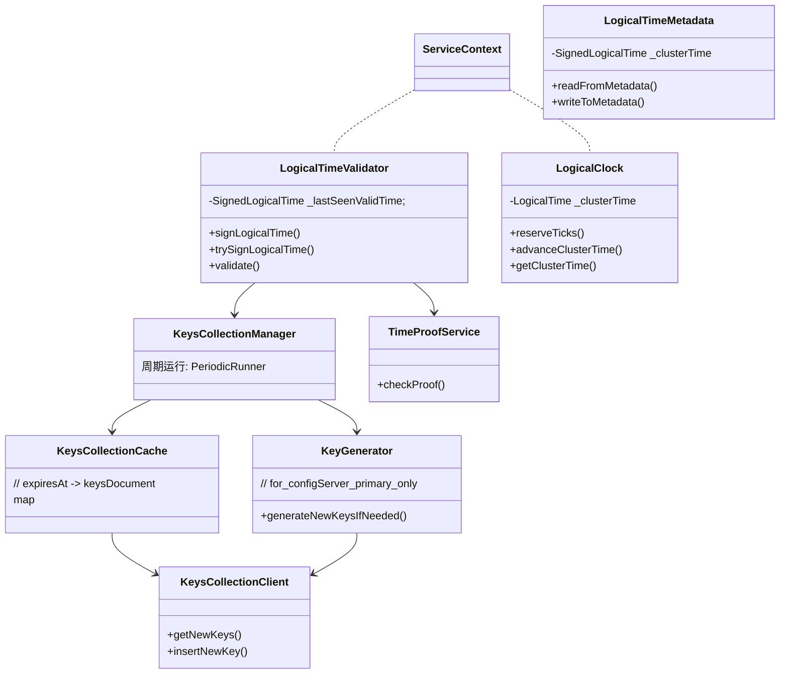

# ClusterTime

[TOC]

### clusterTime demo

```json
{
  "$clusterTime" : {
    "clusterTime" : Timestamp(1495470881, 5),
    "signature" : {
      "hash" : BinData(0, "7olYjQCLtnfORsI9IAhdsftESR4="),
      "keyId" : "6422998367101517844"
    }
  }
}
```


### 核心组件关系




#### 组件初始化

```c++
// for mongod(shardServer&configServer), using KeysCollectionClientDirect
auto keysCollectionClient = stdx::make_unique<KeysCollectionClientDirect>();
// for mongos, using KeysCollectionClientSharded
// auto keysCollectionClient = stdx::make_unique<KeysCollectionClientSharded>(grid->catalogClient());
auto keyManager = std::make_shared<KeysCollectionManager>(
  KeysCollectionManager::kKeyManagerPurposeString, // = "HMAC"
  std::move(keysCollectionClient),
  Seconds(KeysRotationIntervalSec)); // = 90days
keyManager->startMonitoring(startupOpCtx->getServiceContext());

LogicalTimeValidator::set(startupOpCtx->getServiceContext(),
                          stdx::make_unique<LogicalTimeValidator>(keyManager));
```


### 全局时钟维护 - LogicalClock

mongos、shardServer、configServer初始化时都会启动一个 `LogicalClock` ，用来维护该节点目前已知最新的 `LogicalTime`，并提供必要的接口，用于推动时钟（`advanceClusterTime()`）以及tick时钟（`reserveTicks()`）。

### KeysCollectionManager

> KeysCollection : `admin.system.keys`

`KeysCollectionManager` 负责管理维护 KeysCollection。内部运行一个线程（`monitoring-keys-for-HMAC`），定期（`KeysRotationIntervalSec`，默认为90天）加载 keysCollection 中的相关文档，并维护到本地缓存（`KeysCollectionCache`）。

本地缓存（`KeysCollectionCache`）内维护了一个 `expiresAt` --> `KeysDocument` 的map

configServer的primary节点在进行定期加载前会会生成 key信息，并插入到 KeysCollection


### ClusterTime Signature 校验机制 -- `LogicalTimeValidator::validate()`

mongos&shardServer 收到 上游请求后，如果传递的 `clusterTime` 有效（不为0）且 `isAuthorizedToAdvanceClock()` ，会对收到的 `clusterTime` 进行校验：

1. 如果入参的 `clusterTime` 小于 `LogicalTimeValidator::_lastSeenValidTime` ，则无需进行校验
2. 匹配 `admin.system.keys` 中 `expireAt` > `clusterTime` 并且 `keyId` 相等的文档，提取 `key` 字段
3. `clusterTime` 与 `0x0000'0000'0000'FFFF` 或运算，即保留 `clusterTime` 的高位信息（`timeCeil`）
4. 基于 `key` & `timeCeil` 计算 HMAC值，与传入的 `hash` 比较

### ClusterTime的传播 -- `LogicalTimeMetadata`

`LogicalTimeMetadata`  负责 $clusterTime 的元信息维护。

分片集群实例节点之间发生请求交互时，`LogicalTimeMetadata`会将当前节点已知的 clusterTime 添加到请求元信息中。

mongos&shardServer收到上游请求后，`validate()` 后 会进行 `advanceClusterTime`。另外内部请求交互会使用 `LogicalTimeMetadataHook` ，交互完成后 该hook 也会进行 `advanceClusterTime`
