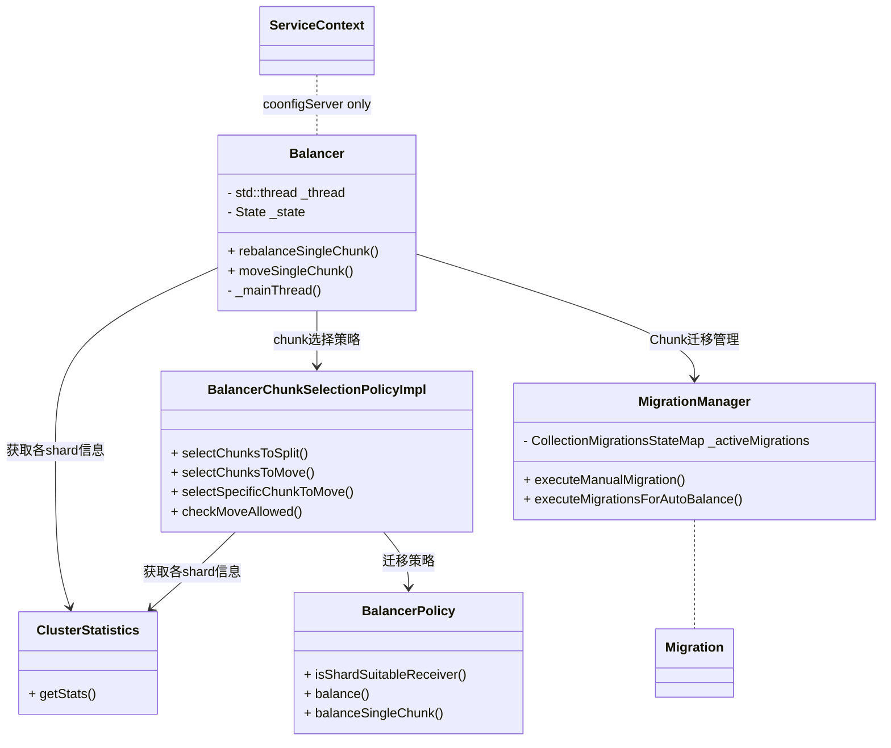
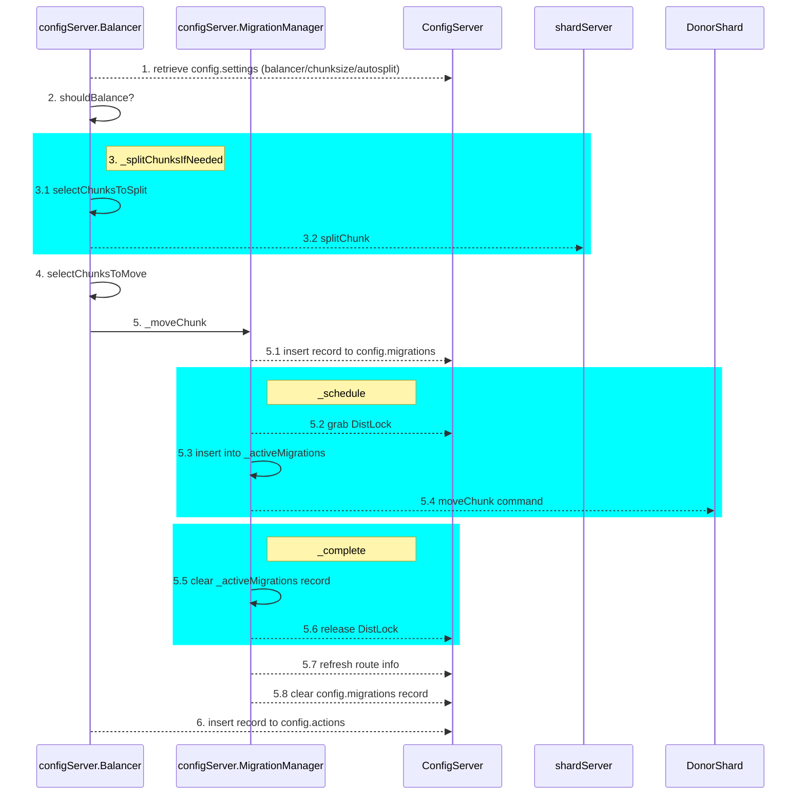

[TOC]


## chunk迁移 触发机制

### 1. 客户端执行 moveChunk 命令

mongos 收到 `moveChunk` 请求后，会将其转换为一个 `_configsvrMoveChunk` 请求发送给 configServer，该命令参数与 `moveChunk` 参数基本完全一致。

configServer 收到 `_configsvrMoveChunk` 后，交由 `Balancer::moveSingleChunk()` 来完成后续操作

#### moveChunk 命令

MongoDB 提供 `moveChunk` 命令以支持用户在shard之间进行 chunk迁移。

```json
db.adminCommand( { moveChunk : <namespace> ,
                 find : <query> ,
                 to : <string>,
                 forceJumbo: <boolean>, // Starting in MongoDB 4.4
                 _secondaryThrottle : <boolean>,
                 writeConcern: <document>,
                 _waitForDelete : <boolean> } )
```


 `moveChunk` 指定目标集合， `find`确定目标chunk， `to` 确定迁移的目标shard。

`_secondaryThrottle`：默认false。true表示迁移过程中，移动完成一条文档都需要等待其同步到至少一个secondary才会移动下一个。

`_waitForDelete`：默认false。true表示 `moveChunk` 命令等待delete阶段完成才会返回

`forceJumbo`：为 4.4 新增参数，用于强制迁移 jumboChunk


> Only use the [`moveChunk`](https://docs.mongodb.com/manual/reference/command/moveChunk/index.html#dbcmd.moveChunk) in special circumstances such as preparing your [sharded cluster](https://docs.mongodb.com/manual/reference/glossary/#term-sharded-cluster) for an initial ingestion of data, or a large bulk import operation. In most cases allow the balancer to create and balance chunks in sharded clusters. See [Create Chunks in a Sharded Cluster](https://docs.mongodb.com/manual/tutorial/create-chunks-in-sharded-cluster/) for more information.

仅在特殊场景下使用 `moveChunk` ，比如准备分片集群以初始接收数据或大批量导入操作。大多数场景下，使用 balancer来进行分片集群的数据均衡。

### 2. Top-chunk optimization

如 splitChunk 文章中介绍的。包含 MinKey 或者 MaxKey 的 chunk 被称作 `topChunk`。如果 topChunk 被 split，那么可能用户有更大的概率对 shardKey 进行单调递增或单调递减的插入。这种情况下 `ChunkSplitter` 会主动向 configServer 发送 `_configsvrMoveChunk` 请求尝试 moveChunk

configServer 收到 `_configsvrMoveChunk` 后，与 客户端执行moveChunk 不同的是，由于 **top-Chunk optimization 未指定 toShardID**，所以这里会交由 `Balancer::rebalanceSingleChunk()` 来完成后续操作（中间会为 chunk 选择目标shard） 

> `_configsvrMoveChunk` 等于是 configServer 提供给内部用于进行moveChunk的入口，针对的就是上面的2个场景

### 3. Balancer自动触发

MongoDB 默认会在 config 节点上运行一个 [Balancer组件](https://docs.mongodb.com/manual/core/sharding-balancer-administration/)，用户自动在 shard 间对chunk进行均衡。


上面的2种触发场景介绍中也可以看到，实际最后也都是交给 Balancer组件 来完成的chunk迁移。只不过不同的触发场景传递的信息是不同的：

* moveChunk指定了待迁移的chunk及目标shard
* top-chunk optimization 仅指定待迁移chunk，需要系统来选择目标shard
* Balancer自动触发 则需要系统选择chunk及目标shard


## Balancer




这里依次来看下Balancer对目标chunk&shard选择策略、Balancer的执行流程与相关配置、Chunk迁移行为。

### Balancer对目标chunk&shard选择机制 -- `ClusterStatistics`&`BalancerPolicy`&`BalancerChunkSelectionPolicy`

Balancer 使用 `ClusterStatistics` 来获取集群当前所有 shard 的基本信息，包括：shard的最大使用空间、shard的当前使用空间、是否是draining模式、shard的tag以及primary的版本。

* primary的版本 是通过向 shard 发送 `serverStatus` 命令获取的
* shard的当前使用空间 是向 shard 发送 `listDatabases` 命令来获取的
* 其余信息则是从 `config.shards` 集合获取


`BalancerPolicy`组件负责确定迁移策略，对外提供三个接口：

* `isShardSuitableReceiver` - 判断 某个shard 是否可以作为 receiver。判断标准： **当前使用空间为达到设置上限** & **未处于draining模式** & **tag符合需求** 
* `balanceSingleChunk` - 为待迁移 chunk 选择一个负载最小的 receiver 。负载最小的定义：从可以作为 receiver 的shard中（即能通过 `isShardSuitableReceiver` 判断条件），选择chunk数量最少的作为 receiver
* `balance` - 输出多组待迁移的chunk，输出的chunk都是独立的 src&dest shard（即系统可以并行的进行chunk迁移）。`balance` 依次进行如下三步操作来完成所有的 待迁移chunk输出：
  * 将 draining模式 的 shard 上的chunk 迁移到其他shard（仍然选择负载最小）
  * 将 与当前shard tag不匹配的chunk 迁移到匹配tag的shard上
  * 在 tag约束条件下，如果 shard 上的数量不均衡，则将chunk从负载最高（chunk数量最多）的shard迁移到负载最低的shard上
  * Notice：
    * 每次选择的 src&dest shard在本轮 `balance` 不会再被选择，即**每个shard每次只能迁移一个shard（作为源或者目标）**。
    * **不会迁移被标记为 jumbo 的 chunk**


`BalancerChunkSelectionPolicy` 组件负责chunk选择的策略，提供4个接口：

* `selectChunksToMove` & `selectSpecificChunkToMove` & `checkMoveAllowed`  均基于 `BalancerPolicy` 提供的接口实现，分别对应 `balance` & `balanceSingleChunk` & `isShardSuitableReceiver`
* `selectChunksToSplit` -- 输出 待split的chunk，这里针对 `config.collections` 中的每个ns，解析出因tag不符而需要split的chunk，（对于sessionColl，还需要保证最小chunk数量限制 -- minNumChunksForSessionsCollection）

### Balancer的执行流程与相关配置

```c++
// If this is a config server node becoming a primary, start the balancer
Balancer::get(opCtx)->initiateBalancer(opCtx);
```

configServer的节点成为 primary节点的时候，系统会启动Balancer，此时会启动一个名为 **Balancer** 的线程。





在系统没有被干预而进入非running状态时，**Balancer线程** 按照如下方式运行：

* 加载系统配置：加载 `config.settings` 集合的 balancer / chunksize / autosplit 三个文档存储的配置信息 (  `refreshAndCheck` )
* 根据 balancer 文档的配置判断 balancer是否开启以及当前是否处于 activeWindow (  `shouldBalance` )
* 尝试进行 splitChunk，保证接下来进行选择待迁移chunk时，获取的信息是可靠的 (  `_splitChunksIfNeeded` )。这里首先选择待split的chunk( `BalancerChunkSelectionPolicy::selectChunksToSplit` ，见上文)，然后分别向这些chunk所在的shard下发 `splitChunk` 请求。
* 选择待迁移chunk (  `BalancerChunkSelectionPolicy::selectChunksToMove`，见上文 )
* 下发moveChunk (  `_moveChunks` )，这里实际是将moveChunk 交给 `MigrationManager` ，并对其返回结果进行处理：
  * 返回ok，计数 numChunksProcessed
  * 返回ChunkTooBig，尝试对该chunk进行split或者标记jumbo
  * 其他：日志打印错误信息
* 上述操作执行完成后，在 `config.actions` 集合中记录一条 balancer.round 文档，当然如果发生异常也会同样记录一条 **balancer.round** 文档及原因
* 最后，这里会根据 numChunksProcessed 的计数，如果为0，则sleep 1s（kShortBalanceRoundInterval）进行下次循环，否则 sleep 10s（kBalanceRoundDefaultInterval）


Balancer的配置管理可以参考官方文档：https://docs.mongodb.com/manual/tutorial/manage-sharded-cluster-balancer/，使用sh命令集以及对config.settings的配置管理对Balancer的行为进行干预。比如设置Balancer开关及时间窗口、设置 `_secondaryThrottle` & `_waitForDelete` 等


### Chunk迁移管理 -- MigrationManager

Balancer使用 `MigrationManager` 来管理 Chunk迁移。

上面提到的chunk迁移的场景，经过 Balancer 后会确定 **MigrateInfo** 信息（包括源shard、目标shard、chunk范围等）。确定的 **MigrateInfo** 会交给 `MigrationManager` 进行统一的调度。

chunk迁移调度方式：

* 将迁移信息写入 `config.migrations` 集合
* 下发 migration 请求 // `_schedule`
  * 获取分布式锁，whyMessage = "Migrating chunk(s) in collection <namespace>"
  * 将迁移信息插入本地的 `_activeMigrations` 记录 
  * 向 fromShard 发送 moveChunk 请求
* 清理 `_schedule` 过程中的一些记录信息
  * 清除 `_activeMigrations` 中的记录
  * 释放分布式锁
* 获取最新路由表确认目标chunk当前所属shard是否符合预期
* 解析 `moveChunk` 结果，并清理 `config.migrations` 记录 // `_processRemoteCommandResponse`


> `config.migrations` 是为了处理 configServer 发生节点切换后的场景处理。分布式锁则是为了保护该集合的更新并发
>
> `_activeMigrations` 是自身迁移处理的状态管理


## Donor shard (fromShard)

```json
{
  "moveChunk": "<namespace>",
  "shardVersion": "<shardVersion>", // 3.4 shard compatibility
  "epoch": "<epoch>",
  "configdb": "<configServerConnectionString>", // 3.4 shard compatibility
  "fromShard": "<fromShardId>",
  "toShard": "<toShardId>",
  "min": { a: 5 },
  "max": { a: 10 },
  "maxChunkSizeBytes": 67108864, // 64MB
  "secondaryThrottle": true|false,
  "waitForDelete": "<waitForDelete>",
  "takeDistLock": false // TODO: delete in 3.8
} 
```


source shard 收到该命令后，完成3件事情：

1. 在 `ActiveMigrationsRegistry` 中注册 `registerDonateChunk`。这里是为了做一下并发控制，来保证一个节点同一时刻只能进行 donating 或者 receiving shard
2. 实际的进行moveChunk行为
3. 如果设置了 waitForDelete ，等待 delete完成


实际进行moveChunk时总共有6个步骤

### step1：MoveTimingHelper初始化

该步骤仅仅是初始化计时器，很快就结束了

### step2：MigrationSourceManager初始化

该步骤完成 MigrationSourceManager 初始化，其中首先获取当前 ns 最新的路由信息，并记录最新的路由信息及UUID信息

`MigrationSourceManager` 状态管理有`kCreated`, `kCloning`, `kCloneCaughtUp`, `kCriticalSection`, `kCloneCompleted`, `kDone` 几个阶段。初始化时，状态为 `kCreated`

### step3：MigrationSourceManager::startClone()

**核心工作：监听增量数据、记录chunk全量信息**

1. 这里首先获取集合的 `CollectionMetadata`，给集合加 IX 锁，并加一个 `CSRLock` X 锁，并初始化一个 `MigrationChunkClonerSourceLegacy`，这是一个负责 Donor 的数据状态管理组件。初始化完成后，这里通过 `std:exchange` + Decoration 的机制来关联 `MigrationSourceManager` 与 `CollectionShardingRuntime`，随后 `MigrationChunkClonerSourceLegacy` 开始监听增量的 oplog信息，并将其储存在自身的 `_reload` & `_deleted` 中（只记录文档对应的 id 字段）。
2. 随后将状态标记为 `kCloning` 
3. `config.changelog` 集合中添加一条 **moveChunk.start** 的记录
4. 开始进入Clone状态：
   1. 初始化一个 _sessionCatalogSource，并 fetchNextOplog // TODO _sessionCatalogSource 干嘛的。。。
   2. 记录待迁移Chunk record信息(`_storeCurrentLocs`)：通过shardKey对应的pattern扫描chunk min到max所有的record记录，并将其 `RecordId` 存储在 `_cloneLocs` 中。这里还会根据 chunk中 record的数量来决定是否标记为 largeChunk（jumboChunk），如果是 largeChunk 则报错，不进行迁移。如果 moveChunk参数中指定 maxChunkSizeBytes，则根据 `maxChunkSizeBytes / 平均collection平均文档大小 * 1.3` 作为largeChunk的标记标准，否则为默认的 `250000`。
   3. 向 destination shard 发送 `_recvChunkStart` 命令


### step4：MigrationSourceManager::awaitToCatchUp()

该阶段会不断给 destination shard 发送 `_recvChunkStatus` 命令并解析返回结果

```json
{
	"_recvChunkStatus": "<namespace>",
	"waitForSteadyOrDone": true,
	"sessionId": "<sessionId>"
}
```


> Respsonse :
>
> ```json
> {
> 	"active" : true,
> 	"sessionId": "<sessionId>",
> 	"ns" : "<namespace>",
> 	"from" : "<fromShardConnectionString>",
> "fromShard": "<fromShardId>",
> "waited": true, // request中 waitForSteadyOrDone = true是包含该字段（为true），同时该命令会等待1s或者状态变为 非READY/CLONE/CATCHUP 状态
> "min": { a: 5 },
> "max": { a: 10 },
> 	"shardKeyPattern" : { a: 1 },
> 	"state" : "xxx",
> 	"counts" : {
> 		"cloned" : NumberLong(0),
> 		"clonedBytes" : NumberLong(0),
> 		"catchup" : NumberLong(0),
> 		"steady" : NumberLong(0)
> 	},
> // other fields: ok / $gleStats / lastCommittedOpTime / $configServerState / $clusterTime / operationTime
> }
> ```


当解析到返回结果 **state = steady** 且 当前计数 **_cloneLocs.size() == 0**（`_cloneLocs` 为待clone文档的集合） 时，该步骤完成。将状态标记为 `kCloneCaughtUp`

其他校验：

* 会解析 ns、fromShardId、min、max、sessionId 等字段与本地字段校验
* 当该步骤执行时间超过 `6h（<kMaxWaitToEnterCriticalSectionTimeout> 固定限制）`时，报错 **Timed out waiting for the cloner to catch up**
* 当统计内存（`_reload` + `_deleted`的总量）超过 `500MB（固定限制）` ，报错 **Aborting migration because of high memory usage**。
  * `_reload` & `_deleted` 记录moveChunk开始后的增量日志，仅记录oplog对应文档的 id 信息

`_recvChunkStatus` 请求间隔：如果收到 `_recvChunkStatus` 的 response中 waited 字段为 true，会进行sleep。sleep时间为 `1LL << std::min(iteration, 10)` ms，iteration在每次收到response时都会自增，即前10次 sleep 1024ms，随后每次sleep时间 *2


> 每次收到 response，都会打印日志：
>
> "moveChunk data transfer progress: " << redact(res) << " mem used: " << _memoryUsed << " documents remaining to clone: " << cloneLocsRemaining


### step5

#### MigrationSourceManager::enterCriticalSection()

step 5.1 - 如果本次迁移的chunk 是 Recipient 的第一个chunk，那么需要向oplog集合插入一条 `{type: "migrateChunkToNewShard", from: "<fromShardId>", to: "<toShardId>"}`，该记录被 changeStream 需要。

step 5.2 - 更新`admin.system.version` 集合中  `_id` 为 "minOpTimeRecovery" 的文档：`{"$set": {"configsvrConnectionString": "<configSvrCS>", "shardName": "<srcShard>", "minOpTime": {"ts": "xx", "t": "xx"}}}, "inc": 1}`，并等待其 majoritedCommitted 

step5.3 - 进入 `ShardingMigrationCriticalSection` 临界区（写入等待），并将状态标记为 `kCriticalSection`

step5.4 - 在 `config.collections` 集合的对应文档，增加 `enterCriticalSectionCounter` 字段计数

> 日志打印：Migration successfully entered critical section


`ShardingMigrationCriticalSection` 临界区实际上是被 `CollectionShardingRuntime` 包装，而后通过 `CollectionCriticalSection` （RAII-style）来对外输出的。内部通过 Notification 实现：

* 外部组件主动 `getSignal` ，并结合 Notification 机制来互相制约

* `enterCriticalSectionCatchUpPhase` 时，初始化 Notification，此时写请求收到制约
* `enterCriticalSectionCommitPhase` 后，读写请求均受到制约
* `exitCriticalSection` 退出临界区


#### MigrationSourceManager::commitChunkOnRecipient()

首先向 Recipient 发送一个 `_recvChunkCommit` 命令，推动 Recipient 进入 **COMMIT_START** 阶段。

```json
{
	"_recvChunkCommit": "<namespace>",
  "waitForSteadyOrDone": false,
	"sessionId": "<sessionId>"
}
```

随后等待 `MigrationChunkClonerSourceLegacy` 中的 `_outstandingOperationTrackRequests` 耗尽，并清理 `_reload` & `_deleted`。 // TODO RecipientShard 收到 _recvChunkCommit 后仅进行单次的 _transferMods ，如果这次没有将 _reload & _deleted 中的结果都传递给 RecipientShard呢？

 将状态标记为 `kCloneCompleted`

### step6：MigrationSourceManager::commitChunkMetadataOnConfig()

集合临界区进入 enterCommitPhase() 阶段，即读取等待。

将 `_configsvrCommitChunkMigration` 请求发送到configServer，并等待结果

```json
{
  "_configsvrCommitChunkMigration": "<namespace>",
  "fromShard": "<fromShardId>",
  "toShard": "<toShardId>",
  "migratedChunk": {}, // chunkType: ns, min, max, shard, etc...
  "fromShardCollectionVersion": [Timestamp(x, x), ObjectId("xxx")],
  "validAfter": Timestamp(x, x)
}
```

这里如果返回结果不是 OK，会在 `config.changelog` 写一条 **moveChunk.validating** 随后 fassert掉

随后刷新 collection 路由信息，并校验 chunk是否 move 成功

> 日志打印：Migration succeeded and updated collection version to << refreshedMetadata->getCollVersion()


开始进行clearup：

* 退出临界区（exitCriticalSection）
* 等待 CatalogCache 中该 collection 的刷新任务完成
* step5.2中，更新`admin.system.version` 集合中  `_id` 为 "minOpTimeRecovery" 的文档，对应的 `{$incr : -1}`


在 `config.changelog` 写入一条 **moveChunk.commit** 日志

向 Recipient 发送一条 `setShardVersion` 命令，刷新 Recipient 路由信息

去 configServer 更新本地路由

如果 `waitForDelete` = true，这里会等待 delete 完成，否则打印日志： "Leaving cleanup of " << getNss().ns() << " range " << redact(range.toString()) << " to complete in background";


### Command： `_migrateClone`

从 `_cloneLocs` 中提取 16MB 以内的最大文档数返回


### Command：`_transferMods`

前面 step3中提到， DonorShard 上自moveChunk开始时，就会监听对应Collection的oplog，并将信息存储在 `MigrationChunkClonerSourceLegacy` 中 `_reload` & `_deleted` 2个list中。其中 `_reload` 存储的是 insert & update 的oplog对应的 id 字段。`_deleted` 存储的是 delete oplog 对应的 id 字段。

而 `_transferMods` 则是 RecipientShard 向 DonorShard 获取增量信息用的，DonorShard 单次给 RecipientShard 最多传递 1MB的数据，先从 `_deleted` 中拿取 id 信息，构成 **deleted** BSONArray，如果不足 1MB，再从 `_reload` 中拿取信息构成 **reload** BSONArray。

值得注意的是 **deleted** 中仅需要包含 id 字段即可，而 **reload** 中需要包含 id 对应的整个文档。


### applyops command

```json
{
	"ts" : Timestamp(1621071732, 25),
	"t" : NumberLong(1),
	"h" : NumberLong(0),
	"v" : 2,
	"op" : "c",
	"ns" : "DB1.$cmd",
	"wall" : ISODate("2021-05-15T09:42:12.486Z"),
	"o" : {
		"applyOps" : [
			{
				"op" : "u",
				"b" : false,
				"ns" : "config.chunks",
				"o" : {
					"_id" : "DB1.Collection2-idx_60.0",
					"lastmod" : Timestamp(5, 0),
					"lastmodEpoch" : ObjectId("609e2b0d761d24c557305b80"),
					"ns" : "DB1.Collection2",
					"min" : {
						"idx" : 60
					},
					"max" : {
						"idx" : 65
					},
					"shard" : "d-2ze8d79fdeb3e2f4",
					"history" : [
						{
							"validAfter" : Timestamp(1621071732, 24),
							"shard" : "d-2ze8d79fdeb3e2f4"
						}
					]
				},
				"o2" : {
					"_id" : "DB1.Collection2-idx_60.0"
				},
				"ui" : UUID("7795bfaf-3578-4105-ae62-1347c4b08a86")
			},
			{
				"op" : "u",
				"b" : false,
				"ns" : "config.chunks",
				"o" : {
					"_id" : "DB1.Collection2-idx_65.0",
					"lastmod" : Timestamp(5, 1),
					"lastmodEpoch" : ObjectId("609e2b0d761d24c557305b80"),
					"ns" : "DB1.Collection2",
					"min" : {
						"idx" : 65
					},
					"max" : {
						"idx" : 70
					},
					"shard" : "d-2zeeef83d4ea2144",
					"jumbo" : false,
					"history" : [
						{
							"validAfter" : Timestamp(1620978445, 6),
							"shard" : "d-2zeeef83d4ea2144"
						}
					]
				},
				"o2" : {
					"_id" : "DB1.Collection2-idx_65.0"
				},
				"ui" : UUID("7795bfaf-3578-4105-ae62-1347c4b08a86")
			}
		],
		"$db" : "DB1"
	}
}
```


## Recipient shard (toShard)

```json
{
  "_recvChunkStart": "<namespace>",
  "sessionId": "<sessionId>",
  "from": "<fromShardConnectionString>",
  "fromShardName": "<fromShardId>",
  "toShardName": "<toShardId>",
  "min": { a: 5 },
  "max": { a: 10 },
  "shardKeyPattern": { a: 1 },
  "secondaryThrottle": true|false,
} 
```


在整个 `moveChunk` 过程中，**receiver** 会收到一个 `_recvChunkStart` 来开始执行 receive chunk 的工作。上面的堆栈就是在这个过程中发生的，我们来具体看下 `_recvChunkStart` 的流程：


### step1 : `_recvChunkStart` 命令处理

destination shard 收到该命令后，同样会在 `ActiveMigrationsRegistry` 中注册 `registerReceiveChunk`，来做并发控制。

### step2 : `MigrationDestinationManager` 初始化

`MigrationDestinationManager` 开始接管整个 receive chunk 流程。首先进行 `start` ：

* 进行各变量初始化
* 将同步状态置为 `READY`
* 启动一个名为 `migrateThread` 的线程
* 同时初始化一个 `SessionCatalogMigrationDestination` 对象 `_sessionMigration`

### Step3 : 主要的工作均在 `MigrationDestinationManager::_migrateDriver()` 中完成。

正常情况下，**receiver** 进行数据复制分为6个阶段，依次是： `READY` --> `CLONE` --> `CATCHUP` --> `STEADY` --> `COMMIT_START` --> `DONE`。在整个过程中，会启动一个 timer 来对不同的阶段进行计时，timer 也分为6个阶段，但与上面提到的 数据复制 6个阶段不完全一致，下文详述对应关系。

另外还有 `FAIL` / `ABORT` 为两种异常状态。

接下来逐步看下这几个阶段的行为：

#### step3.1 : `READY`

* 该阶段首先依次通过 `listIndexes` / `listCollections` 来从 **donator** 获取对应的 index和collection 信息。如果当前节点没有 collection或者有缺失的index，则进行相应的创建。// `MigrationDestinationManager::cloneCollectionIndexesAndOptions`
* **至此结束计时为 timer 的 step1**
* 随后会**同步**清理 目标chunk区间 的document：
  * 清理目标chunk区间的document 的任务交给 **Collection-Range-Deleter** 线程来完成，同时返回一个 Notification，当前线程(即 **migrateThread**) 会等待这个 Notification，期间一直处于等待状态。// `MigrationDestinationManager::_notePending`
  * 等待MetadataManager的其他CollectionMetadata的中包含该range的待清理orphan文档也清理完成。// `CollectionShardingRuntime::waitForClean`
* **至此结束计时为 timer 的 step2** 


#### step3.2 : `CLONE`

* CLONE阶段 首先会在 `_sessionMigration` 里启动一个名为 **sessionCatalogMigrationProducer-[_sessionId]** 的线程。该线程不断会构造 `{"_getNextSessionMods": 1, "sessionId": [_sessionId]}` 请求，从 **donator** 拉取oplog，然后进行应用 // `SessionCatalogMigrationDestination::_retrieveSessionStateFromSource`
  *  **// TODO 1. source返回结果；2. apply行为；3. 像是针对事务、session相关日志应用**
* 然后构建一个 `{"_migrateClone": [namespace], "sessionId": [_sessionId]}` 的请求，在当前线程(即 **migrateThread**) 不断从 **donator** 拉取 document 数据，然后创建一个名为 **chunkInserter** 的线程接收结果，并构造 insert 请求插入到本地（order: true, 受secondaryThrottle、writeConcern影响）。直到拉取返回的结果为空，则此阶段完成。 // `MigrationDestinationManager::cloneDocumentsFromDonor`
  * insert到本地有几个干预行为：
    * 每次insert之前会check opCtx是否已经interrupt、check 当前状态是否为 ABORT
    * 单次 insert 文档数量受 **migrateCloneInsertionBatchSize** 参数限制，默认为0，无限制
    * 两次 insert 之间会进行sleep，受 **migrateCloneInsertionBatchDelayMS** 参数限制，默认为0，不sleep
* **至此结束计时为 timer 的 step3**

#### step3.3 : `CATCHUP`

* CATCHUP阶段 构造一个  `{"_transferMods": [namespace], "sessionId": [_sessionId]}` 请求，如果返回的结果有 deleted 字段，则构造删除请求删除其中文档。如果返回结果有 reload 字段，则构造请求进行更新。
* 这里有个循环，持续校验 opReplicatedEnough，循环 3600 * 50 次校验，两次校验间 sleep 20ms
* **至此结束计时为 timer 的 step4**
* 等待 lastOpApplied 数据同步完成。 **// TODO 和上面的 opReplicatedEnough 区别是？**
* **这里阶段仍然是 `CATCHUP`，但是timer计时归属在 step5 中。**

#### step3.4 : `STEADY` 

该和 `CATCHUP` 阶段比较相似，也是使用上文提及的 `_transferMods` 请求不断从 donator 拉取数据并应用，同时更新`lastOpApplied`。拉取数据之间sleep 10ms


#### step3.5 :  `COMMIT_START`

接收 `_recvChunkCommit` 请求，该请求主要在 `MigrationDestinationManager::startCommit` 中处理，将`MigrationDestinationManager` 会进入 `COMMIT_START` 阶段。

而 `migrateThread` 线程 的行为与上面 **step3.4** 基本一致。区别是，这里只会拉取一次  `_transferMods` 数据并应用&更新`lastOpApplied`。而收到 `_recvChunkCommit` 表示当前chunk 禁写，所以会进行 `_flushPendingWrites` 将同步时间戳推进到 `lastOpApplied` 即表示增量同步完成。


// TODO 会将 SessionCatalogMigrationDestination 的状态标记位 Migrating ，随后 notify all


> 这里可能有如下问题？ // TODO
>
> DonorShard Collection禁写前，如果 _deleted & _reload 中构成 _transferMods 结果的数据总量超过单次限制（1MB）。而 RecipientShard 只进行一次 _transferMods ，那么会导致有增量的数据没有传递过来


这2个阶段结束后为 timer 的 step5

然后将 step3.2 中 `_sessionMigration` 启动的 **sessionCatalogMigrationProducer-[_sessionId]** 线程 join到当前线程。

#### step3.6 : `DONE`

该阶段仅将 状态标记为 `DONE`，**并结束 timer 的 step6计时。**


到这里 `_recvChunkStart` 命令整个处理流程就结束了。

* 如果上述 6 个阶段均顺利完成，则 **receiver** 会在 `config.changelog` 中插入一条记录。该记录包含 `{"what": "moveChunk.to", "detail": {"note": "success"}}` 及相关信息。
* 如果中间任何一个阶段出现异常，则将状态置为 `FAIL`，同时插入在 `config.changelog` 的记录中 `detail.note = aborted`

另外如果收到 `_recvChunkAbort` 请求，则会将状态置为 `ABORTED`，上文的各个阶段均有对 `ABORT` 的处理，随即流程结束。


## 相关类

`ShardingStatistics` 负责状态信息统计

`MigrationDestinationManager` receiver 主要处理流程

`SessionCatalogMigrationDestination` ？

`StartChunkCloneRequest` 保存 `_recvChunkStart` 的参数信息

`ActiveMigrationsRegistry` moveChunk并发控制

## 参考：

1. https://docs.mongodb.com/manual/reference/command/moveChunk/index.html
2. 

